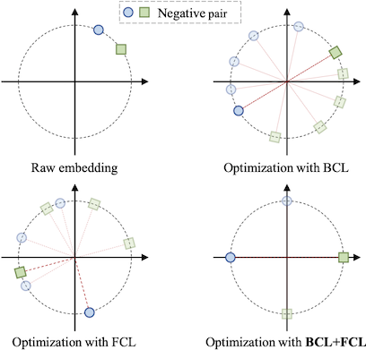
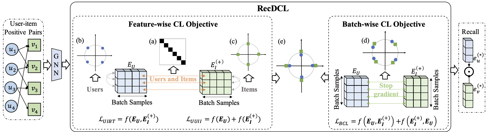
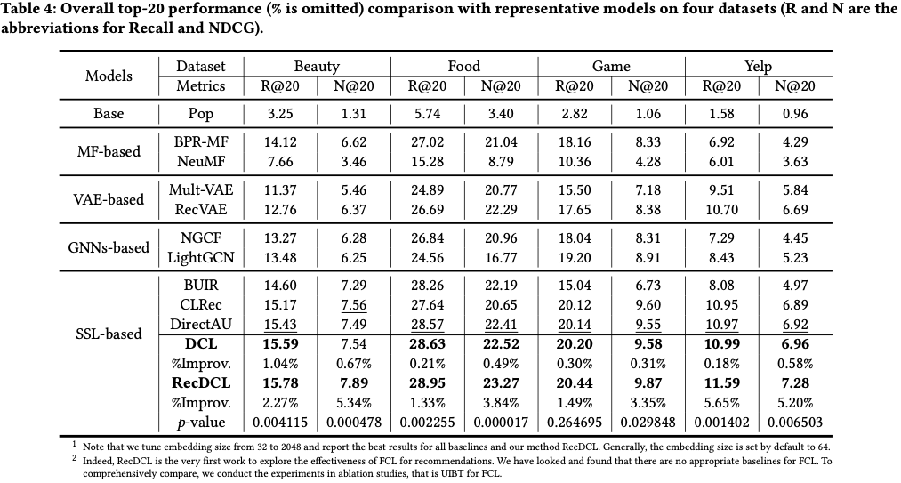

# RecDCL: Dual Contrastive Learning for Recommendation

<p align="center">
📃 <a href="https://arxiv.org/abs/2401.15635v2" target="_blank">[RecDCL]</a> <a href="https://github.com/THUDM/RecDCL" target="_blank">[GitHub]</a> <br>
</p>

**RecDCL** is a dual contrastive learning recommendation framework. In this work, we investigate how to employ both batch-wise CL (BCL) and feature-wise CL (FCL) for recommendation. We theoretically analyze the relation between BCL and FCL, and find that combining BCL and FCL helps eliminate redundant solutions but never misses an optimal solution. In RecDCL, the FCL objective is designed to eliminate redundant solutions on user-item positive pairs and to optimize the uniform distributions within users and items using a polynomial kernel for driving the representations to be orthogonal; The BCL objective is utilized to generate contrastive embeddings on output vectors for enhancing the robustness of the representations. Extensive experiments on four widely-used benchmarks and one industry dataset demonstrate that RecDCL can consistently outperform the state-of-the-art GNNs-based and SSL-based models (with an improvement of up to 5.65\% in terms of Recall@20).





## **Table of Contents**

- [PyTorch Implementation](#Implementation)
- [Leaderboard](#Leaderboard)
- [Citation](#Citation)

## **PyTorch Implementation**

This is our PyTorch implementation for the WWW'24 paper:

### Environment Requirements

The code has been tested running under Python 3.10.9. The required packages are as follows:

- PyTorch == 2.0.1

### Usage Example
#### Running one trial on Beauty:

```
bash run_beauty.sh
```
## **Leaderboard**

Overall top-20 performance comparison with representative models on four datasets.




## Citation
If you find our work helpful, please kindly cite our paper:

```
@inproceedings{zhang2024recdcl,
  title={RecDCL: Dual Contrastive Learning for Recommendation},
  author={Zhang, Dan and Geng, Yangliao and Gong, Wenwen and Qi, Zhongang and Chen, Zhiyu and Tang, Xing and Shan, Ying and Dong, Yuxiao and Tang, Jie},
  booktitle={Proceedings of the ACM on Web Conference 2024},
  pages={3655--3666},
  year={2024}
}
```
